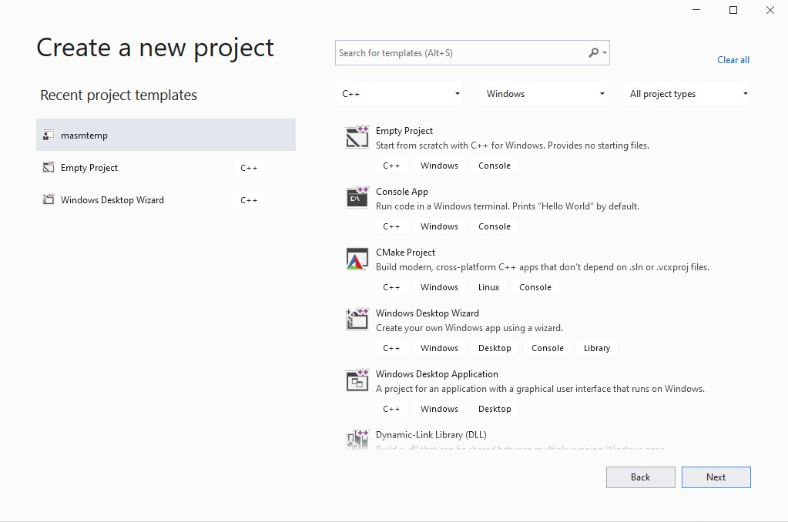
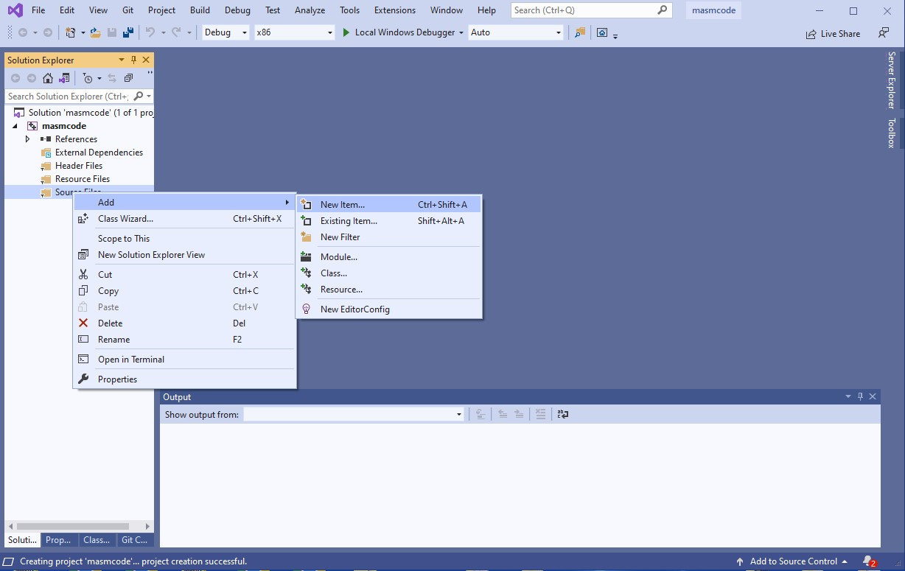
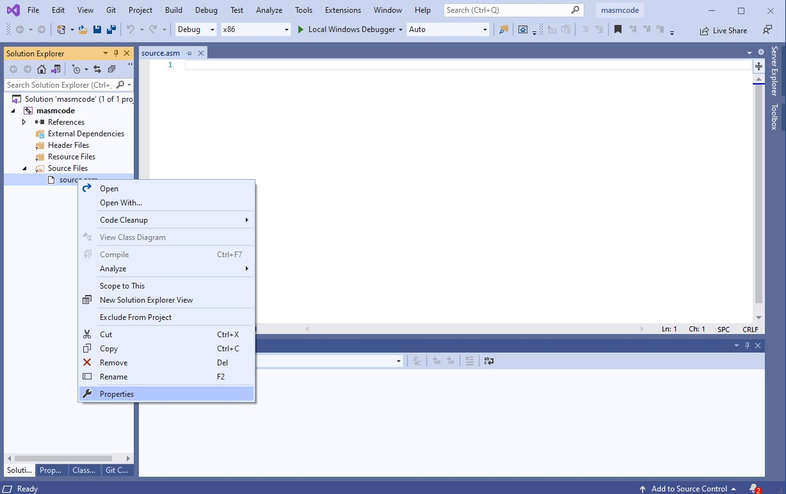
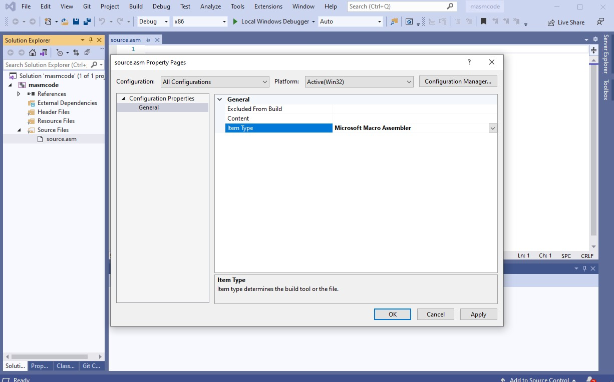
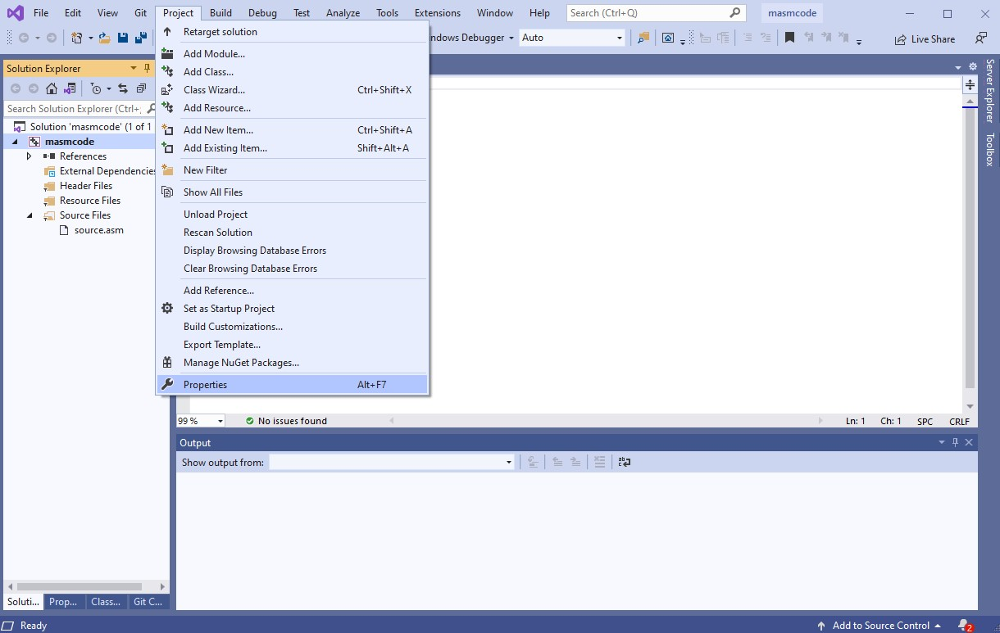
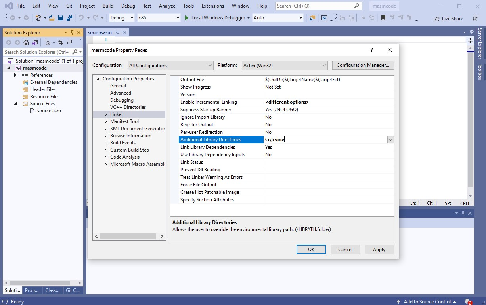
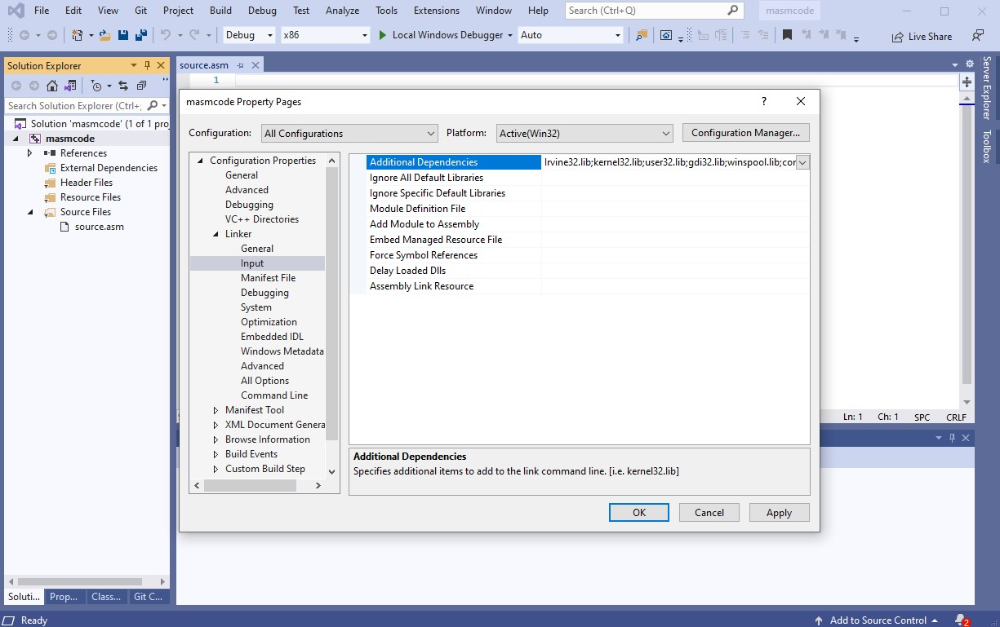
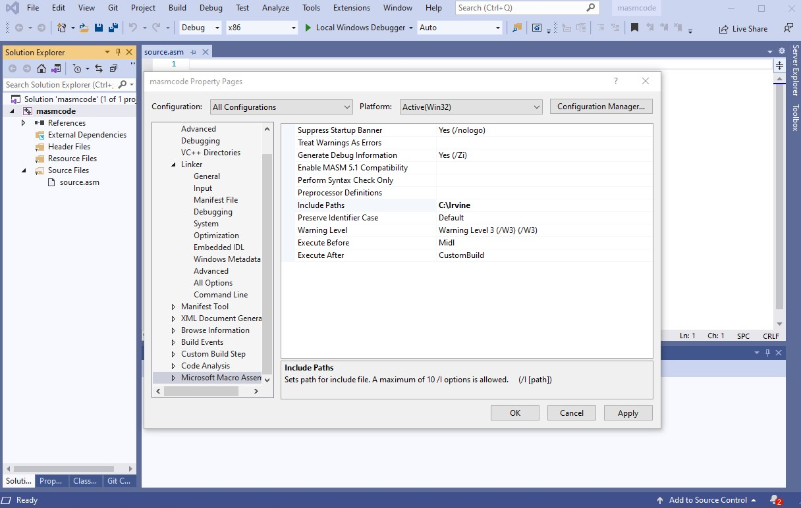

# This is the basic guide to set up MASM and Irvine library in Visual Studio

## Set up for MASM codes

### Create project
---

### Create code
---

### Edit build dependency
---

### Edit item type
---

## Set up for Irvine library

### Add additional library directory
---

### Add additional dependency
---

### Include path
---
